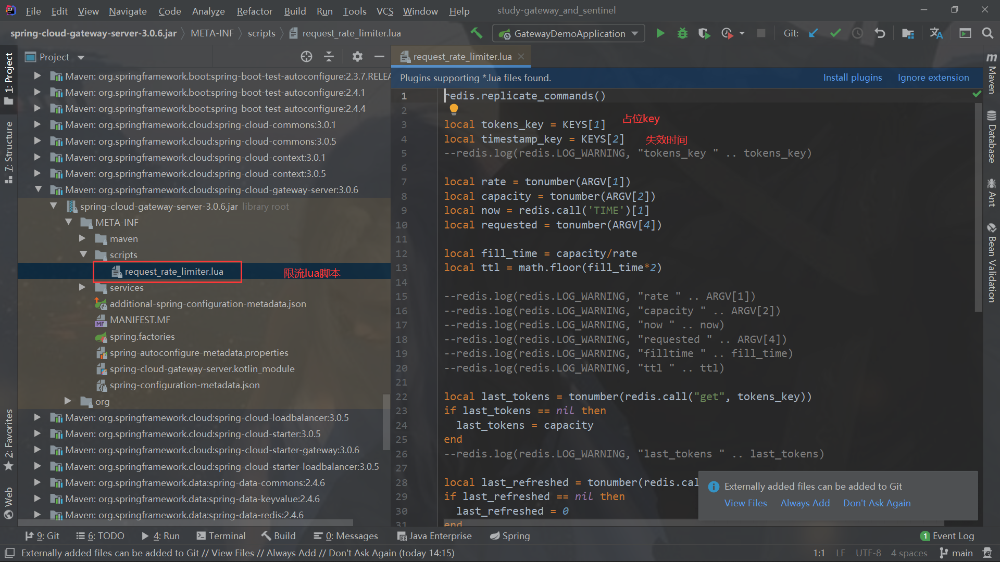
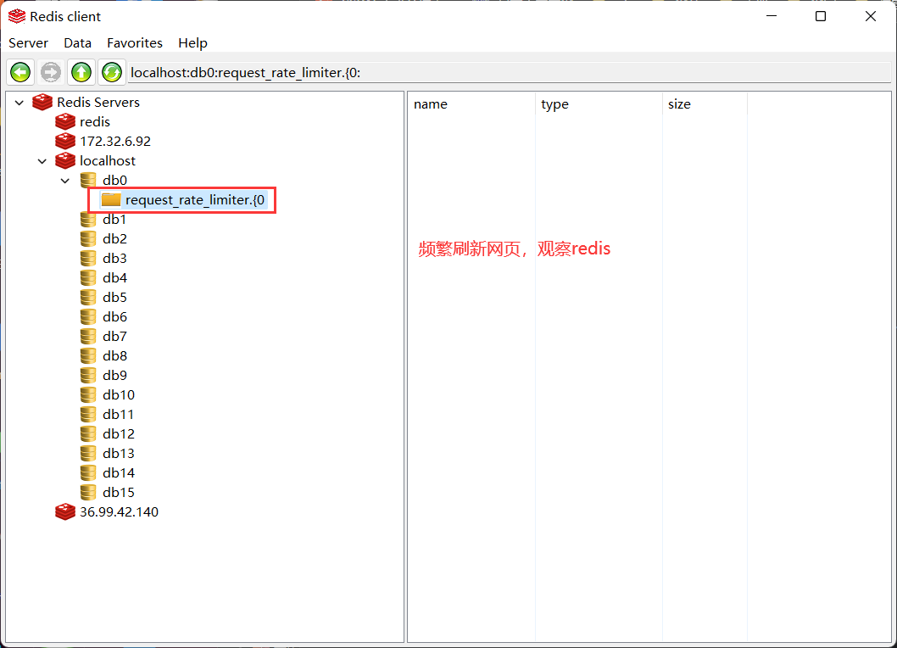
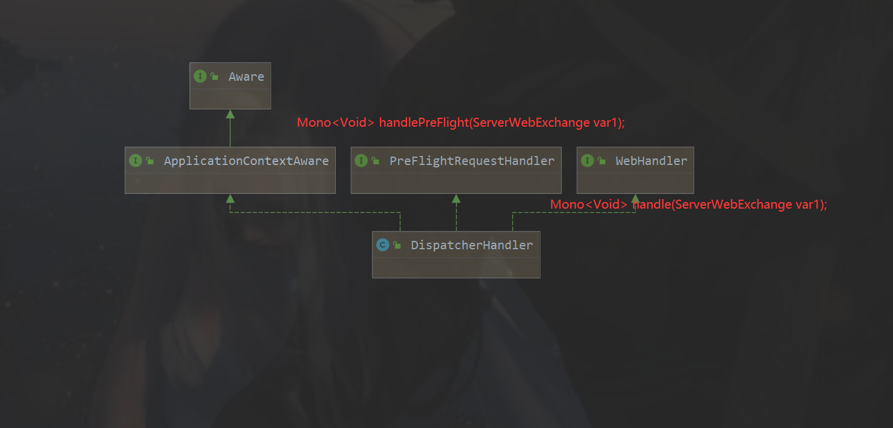
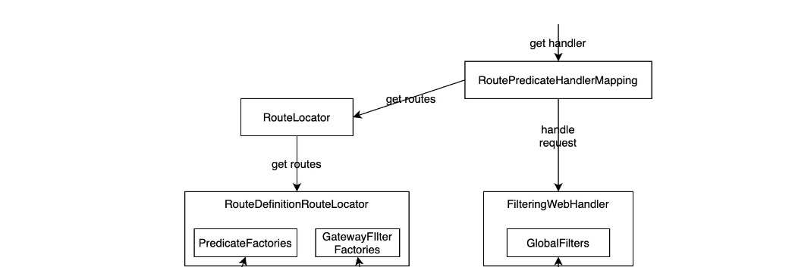
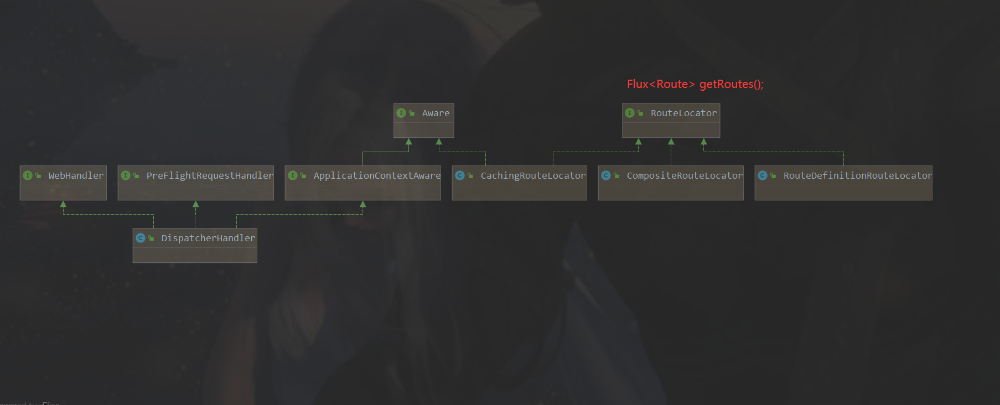
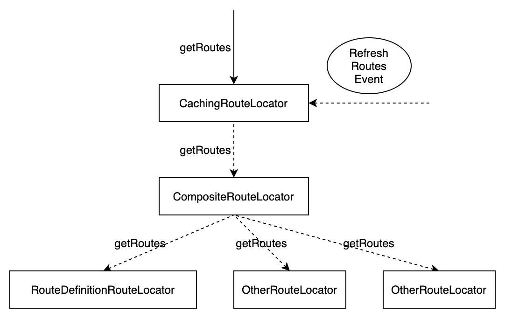
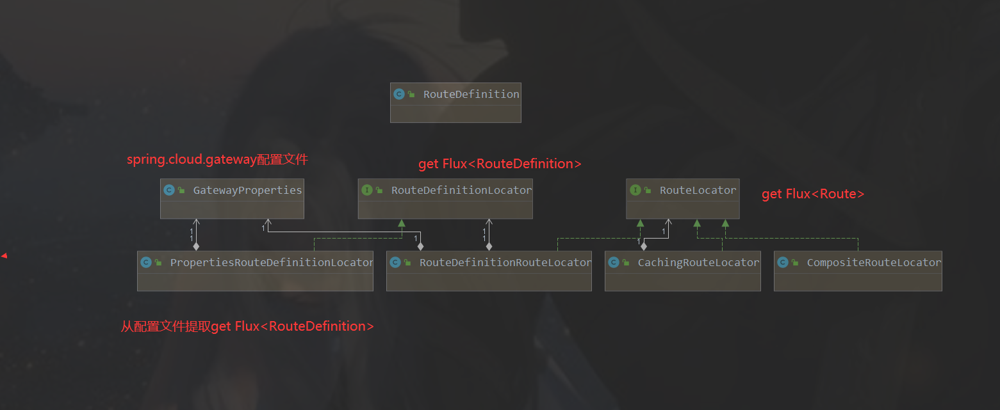

### SpringCloud Alibaba Gateway实践与原理学习


#### 一、实践


##### 1、项目环境搭建

网关微服务模块版本控制

```xml
 <version>0.0.1</version>
    <name>gateway-demo</name>
    <description>使用gateway的demo</description>

    <properties>
        <java.version>11</java.version>
        <project.build.sourceEncoding>UTF-8</project.build.sourceEncoding>
        <project.reporting.outputEncoding>UTF-8</project.reporting.outputEncoding>
        <spring-boot.version>2.4.4</spring-boot.version>
        <spring-cloud.version>2020.0.5</spring-cloud.version>
    </properties>


	...
	...

 <dependencyManagement>
        <dependencies>
            <!--    springcloud 依赖版本管理-->
            <dependency>
                <groupId>org.springframework.cloud</groupId>
                <artifactId>spring-cloud-dependencies</artifactId>
                <version>${spring-cloud.version}</version>
                <type>pom</type>
                <scope>import</scope>
            </dependency>
            <!--    springboot 依赖版本管理-->

            <dependency>
                <groupId>org.springframework.boot</groupId>
                <artifactId>spring-boot-dependencies</artifactId>
                <version>${spring-boot.version}</version>
                <type>pom</type>
                <scope>import</scope>
            </dependency>
        </dependencies>
```

新建gateway的maven项目引入依赖

```xml
<!--        Gateway依赖-->
        <dependency>
            <groupId>org.springframework.cloud</groupId>
            <artifactId>spring-cloud-starter-gateway</artifactId>
        </dependency>

<!--        使用gateway的负载均衡，必须导入此依赖-->
        <dependency>
            <groupId>org.springframework.cloud</groupId>
            <artifactId>spring-cloud-starter-loadbalancer</artifactId>
        </dependency>


<!--        nacos服务与发现-->
        <dependency>
            <groupId>com.alibaba.cloud</groupId>
            <artifactId>spring-cloud-starter-alibaba-nacos-discovery</artifactId>
            <version>2021.1</version>
        </dependency>

<!--        nacos配置中心-->
        <dependency>
            <groupId>com.alibaba.cloud</groupId>
            <artifactId>spring-cloud-starter-alibaba-nacos-config</artifactId>
            <version>2021.1</version>
        </dependency>
```


最后新建provider-demo的web项目、启动nacos-server，启动provideo-demo、gateway-demo项目，查看nacos可视化界面，保证正确注册。

```yml
# nacos服务发现注册
spring:
  cloud:
    nacos:
      discovery:
        server-addr: 127.0.0.1:8848
```


##### 2、配置测试路由、负载均衡

首先测试`localhost:80/test/hello`能否正确访问provider-demo接口，然后在gateway模块使用yml文件配置路由，测试`localhost:8080/test/hello`能否访问provider-demo模块接口，然后启动不同端口的2个以上provider-demo的实例，在测试负载均衡访问`localhost:8080/loadbalance/hello`

```yml
spring:
  cloud:
    nacos:
      discovery:
        server-addr: 127.0.0.1:8848

    gateway:
      routes:
        - id : test-router1
          uri: http://localhost:80   # provider-demo的 的路由地址
          predicates:
            - Path=/test/**
        - id: provider-dynamic-loadbalance-router  # 路由的id，没有固定规则但要求唯一，建议配合服务名
          # uri: http://localhost:8001   # 匹配后提供服务的路由地址
          uri: lb://provider-demo   # 需要注意的是uri的协议为lb，表示启用Gateway的负载均衡功能。lb://serviceName是spring cloud gateway在微服务中自动为我们创建的负载均衡uri。
          predicates:
            - Path=/loadbalance/**         # 断言，路径相匹配的路由

```

测试配置类配置路由

```java
package henu.soft.scl.router;

/**
 * @author sichaolong
 * @date 2022/8/19 15:30
 */

import org.springframework.cloud.gateway.route.RouteLocator;
import org.springframework.cloud.gateway.route.builder.RouteLocatorBuilder;
import org.springframework.cloud.gateway.support.ipresolver.RemoteAddressResolver;
import org.springframework.cloud.gateway.support.ipresolver.XForwardedRemoteAddressResolver;
import org.springframework.context.annotation.Bean;
import org.springframework.context.annotation.Configuration;

/**
 * 配置路由有两种方式：1、通过配置文件。2、通过配置类
 * 这里通过配置类配置路由
 */
/**
 * 配置路由有两种方式：1、通过配置文件。2、通过配置类(测试test_router2、test_router3暂时不能使用）
 * 这里通过配置类配置路由
 */
@Configuration
public class MyRouter {
    @Bean
    public RouteLocator customerRouteLocator(RouteLocatorBuilder routeLocatorBuilder) {

        return routeLocatorBuilder.routes()
                .route("test_router2", r ->
                        r.path("/test2").uri("http://www.baidu.com"))
                .route("test_router3", r ->
                        r.path("/test3").uri("http://localhost:80/test/hello"))
                .route(
                        // 第一个参数是路由的唯一身份
                        "path_route_lb",
                        // 第二个参数是个lambda实现，
                        // 设置了配套条件是按照请求路径匹配，以及转发地址，
                        // 注意lb://表示这是个服务名，要从
                        r -> r.path("/lbtest/**").uri("lb://provider-demo")
                )
//                .route("test1", r -> {
//                    return r.host("*.somehost.org").and().path("/somepath")
//                            .filters(f -> f.addRequestHeader("header1", "header-value-1"))
//                            .uri("http://someuri")
//                            .metadata(RESPONSE_TIMEOUT_ATTR, 200)
//                            .metadata(CONNECT_TIMEOUT_ATTR, 200);
//                })
                .build();


    }
}

```


注意：测试gateway的负载均衡需要额外引入loadbalance依赖！！！

##### 3、测试配置GlobalFilter拦截器模拟登录验证

定义MyLoginGlobalFilter类实现GlobalFilter, Ordered，重写相应方法

```java
package henu.soft.scl.filter;

import com.alibaba.cloud.commons.lang.StringUtils;
import lombok.extern.slf4j.Slf4j;
import org.springframework.cloud.gateway.filter.GatewayFilterChain;
import org.springframework.cloud.gateway.filter.GlobalFilter;
import org.springframework.context.annotation.Configuration;
import org.springframework.core.Ordered;
import org.springframework.http.HttpStatus;
import org.springframework.stereotype.Component;
import org.springframework.web.server.ServerWebExchange;
import reactor.core.publisher.Mono;

import java.util.Date;
import java.util.List;

/**
 * @author sichaolong
 * @date 2022/8/19 17:00
 */

/**
 * name : MyLoginGlobalFilter.java
 * creator : sichaolong
 * date : 2022/8/19 17:01
 * descript : gateway做登录验证
**/

@Component
@Slf4j
public class MyLoginGlobalFilter implements GlobalFilter, Ordered {
    @Override
    public Mono<Void> filter(ServerWebExchange exchange, GatewayFilterChain chain) {

        log.info("come in MyLogGatewayFilter: " + new Date());
//        String name = exchange.getRequest().getQueryParams().getFirst("name");
        String token = exchange.getRequest().getHeaders().getFirst("token");

        log.info("token is :{}",token );
//        if (StringUtils.isBlank(token)) {
//            log.info("用户未登录!");
//            exchange.getResponse().setStatusCode(HttpStatus.NOT_ACCEPTABLE);
//            return exchange.getResponse().setComplete();
//        }
        // 继续下一个filter
        return chain.filter(exchange);
    }

    @Override
    public int getOrder() {
        return 0;
    }
}

```


##### 4、配置CROS跨域


```java
package henu.soft.scl.config;

import org.springframework.context.annotation.Bean;
import org.springframework.context.annotation.Configuration;
import org.springframework.web.cors.CorsConfiguration;
import org.springframework.web.cors.reactive.CorsWebFilter;
import org.springframework.web.cors.reactive.UrlBasedCorsConfigurationSource;

/**
 * @author sichaolong
 * @date 2022/8/19 14:51
 */
@Configuration
public class MyCrosConfig {

    @Bean
    public CorsWebFilter CorsWebFilter(){
        UrlBasedCorsConfigurationSource source = new UrlBasedCorsConfigurationSource();

        CorsConfiguration corsConfiguration = new CorsConfiguration();

        // 这里配置跨域
        corsConfiguration.addAllowedHeader("*");
        corsConfiguration.addAllowedMethod("*");
        corsConfiguration.addAllowedOrigin("*");
        corsConfiguration.setAllowCredentials(true);

        source.registerCorsConfiguration("/**",corsConfiguration);

        return new CorsWebFilter(source);
    }


}

```


##### 5、测试配置限流

借助gateway内置的限流API来限流，参考https://juejin.cn/post/6844903742731452424

在Spring Cloud Gateway中，有Filter过滤器，因此可以在“pre”类型的Filter中自行实现上述三种过滤器。但是限流作为网关最基本的功能，Spring Cloud Gateway官方就提供了RequestRateLimiterGatewayFilterFactory这个类，适用Redis和lua脚本实现了令牌桶的方式。具体实现逻辑在RequestRateLimiterGatewayFilterFactory类中，lua脚本在如下图所示的文件夹中：



```xml
<!--        Gateway依赖-->
        <dependency>
            <groupId>org.springframework.cloud</groupId>
            <artifactId>spring-cloud-starter-gateway</artifactId>
        </dependency>

<!--        使用gateway的负载均衡，必须导入此依赖-->
        <dependency>
            <groupId>org.springframework.cloud</groupId>
            <artifactId>spring-cloud-starter-loadbalancer</artifactId>
        </dependency>

<!--        使用gateway的限流，需要借助redis-->
        <dependency>
            <groupId>org.springframework.boot</groupId>
            <artifactId>spring-boot-starter-data-redis-reactive</artifactId>
        </dependency>
```

编写限流配置，然后测试，频发刷新网页，发现报错429，查看redis

```yml
spring:
  cloud:
    nacos:
      discovery:
        server-addr: 127.0.0.1:8848
    gateway:
      routes:
        - id : test-router1
          uri: http://localhost:80   # provider-demo的 的路由地址
          predicates:
            - Path=/test/**
          # gateway限流
          filters:
            - name: RequestRateLimiter
              args:
                key-resolver: '#{@myRequestRateLimit}'
                redis-rate-limiter.replenishRate: 1
                redis-rate-limiter.burstCapacity: 3
        - id: provider-dynamic-loadbalance-router  # 路由的id，没有固定规则但要求唯一，建议配合服务名
          # uri: http://localhost:8001   # 匹配后提供服务的路由地址
          uri: lb://provider-demo   # 需要注意的是uri的协议为lb，表示启用Gateway的负载均衡功能。lb://serviceName是spring cloud gateway在微服务中自动为我们创建的负载均衡uri。
          predicates:
            - Path=/loadbalance/**         # 断言，路径相匹配的路由

  # gateway借助内置API和redis实现令牌桶限流
  redis:
    host: 127.0.0.1
    port: 6379

```

```java
package henu.soft.scl.ratelimit;

import org.springframework.cloud.gateway.filter.ratelimit.KeyResolver;
import org.springframework.context.annotation.Configuration;
import org.springframework.web.server.ServerWebExchange;
import reactor.core.publisher.Mono;

/**
 * @author sichaolong
 * @date 2022/8/26 20:27
 */

/**
 * name : MyRequestRateLimit.java
 * creator : sichaolong
 * date : 2022/8/26 20:28
 * descript : gateway限流，根据指定的request参数限流
**/

@Configuration
public class MyRequestRateLimit implements KeyResolver {
    @Override
    public Mono<String> resolve(ServerWebExchange exchange) {
        // 根据请求url限流
        // return Mono.just(exchange.getRequest().getURI().getPath());

        // 根据远程客户端地址限流
        return Mono.just(exchange.getRequest().getRemoteAddress().getAddress().getHostAddress());

    }
}

```





#### 二、原理分析


##### 1、请求路由流程

1. 进来的请求由 `DispatcherHandler`处理。
2. `DispatcherHandler` 遍历所有的HandlerMapping调用其handler方法，其中 `RoutePredicateHandlerMapping` 间接实现HandlerMapping 的handler方法。
3. 在handler方法内部`RoutePredicateHandlerMapping` 依赖 `RouteLocator` 获取所有路由配置`Flux<Route>`并根据匹配条件打到请求匹配的路由Route。
4. `RoutePredicateHandlerMapping` 把请求交给 `FilteringWebHandler` 处理。
5. `FilteringWebHandler` 从请求匹配的路由获取对应的路由 Filter，并和全局 Filter 合并构造 `GatewayFilterChain`，请求最终由 `GatewayFilterChain` 里的 Filter 按顺序处理。

##### 2、核心类分析

###### （1）DispatcherHandler

DispatcherHandler是所有请求的调度器负责分发请求，成员属性包含`List<HandlerMapping>`、`List<HandlerAdapter>`、`List<HandlerResultHandler>`



handler方法式请求的入口，接着遍历HandlerMapping的实现类，调用调用相应的getHandler方法

```java
   public Mono<Void> handle(ServerWebExchange exchange) {
        if (this.handlerMappings == null) {
            return this.createNotFoundError();
        } else {
            return 
                CorsUtils.isPreFlightRequest(exchange.getRequest()) ? // 是否是PreFlightRequest
                this.handlePreFlight(exchange) // 是PreFlightRequest
                : Flux.fromIterable(this.handlerMappings).concatMap((mapping) -> { return mapping.getHandler(exchange); // 不是PreFlightRequest，需要遍历HandlerMapping，调用getHandler()
            }).next().switchIfEmpty(this.createNotFoundError()).flatMap((handler) -> {
                return this.invokeHandler(exchange, handler);
            }).flatMap((result) -> {
                return this.handleResult(exchange, result);
            });
        }
    }
```

HandlerMapping的间接实现`RoutePredicateHandlerMapping`类，该类借助RouteLocator从配置中解析的`Flux<Route>` 匹配Route，然后借助FilteringWebHandler构造`List<GatewayFilter>`过滤器链




Gateway Filter 处理请求和响应相关的核心代码在 `FilteringWebHandler` 类。也就是请求最终由 `GatewayFilterChain` 里的 Filter 按顺序处理。


###### （2）RouteLocator

Gateway 通过接口 `RouteLocator` 接口来获取路由配置，`RouteLocator` 有不同的实现，对应了不同的定义路由的方式。

- 通过自定义配置类配置路由：将RouteLocator放到容器，形参注入 `RouteLocatorBuilder` ，然后调用形参的builder()方法返回包含path、url、filter等的`RouteLocator` 
- 通过自定义yaml配置文件配置路由：`RouteLocator` 另一种常用的实现是 `RouteDefinitionRouteLocator` 。这种实现依赖于 `RouteDefinitionLocator` 来提供 `RouteDefinition` ，再由 `RouteDefinition` 构造路由。



多个 `RouteLocator` 可以同时使用，这些实例提供的路由最终会由 `CompositeRouteLocator` 整合，再由 `CachingRouteLocator` 缓存。他们之间的关系如图。也就是最终的routeLocator会保存在CachingRouteLocator中，当




###### （3）RouteDefinition

`RouteDefinition` 和 `Route` 的区别在于 `RouteDefinition` 是一种便于序列化的对象。它定义了一个路由应该包含哪些匹配条件和过滤器，以及这些匹配条件和过滤器使用的参数。在使用时 Gateway 会根据 `RouteDefinition` 对象提供的定义构造出 `Route` 对象。

下面的GatewayProperties、PropertiesRouteDefinitionLocator是yml配置路由解析到RouteDefinition的核心实现，然后RouteLocator在根据RouteDefinition构造路由Route。




另外Gateway 在构造 `Route` 对象时会根据 `RouteDefinition` 配置的匹配条件名和过滤器名找到对应的 `Factory` 获取对应的匹配条件和过滤器实例链。


###### （4）RoutePredicateFactory

Spring Cloud Gateway 本身已经提供了很多常用的 Predicate 实现，常用的匹配规则都可以直接配置使用，比如 Host、Header、请求参数、请求方法等。需要自定义匹配规则时可以实现接口 `RoutePredicateFactory`


###### （5）GlobalFilter

过滤器包含了 Gateway 处理请求和响应的核心逻辑。一些功能比较基础通用的过滤器 Spring Cloud Gateway 项目本身已经实现提供了，可以直接配置使用。Spring Cloud Gateway 过滤器分为两类，全局 Filter 和路由 Filter。

全局 Filter 顾名思义就是会自动对所有的路由都生效的过滤器，有些功能比如全局日志、监控等就比较适合设计成全局过滤器。这类过滤器对应的是 `GlobalFilter` 接口。需要自定义的全局过滤器时只要实现这个接口并注册成 Bean 即可。

如练习gateway做登录权限认证就是自定义filter实现了GlobalFilter

```java
package henu.soft.scl.filter;

import com.alibaba.cloud.commons.lang.StringUtils;
import lombok.extern.slf4j.Slf4j;
import org.springframework.cloud.gateway.filter.GatewayFilterChain;
import org.springframework.cloud.gateway.filter.GlobalFilter;
import org.springframework.context.annotation.Configuration;
import org.springframework.core.Ordered;
import org.springframework.http.HttpStatus;
import org.springframework.stereotype.Component;
import org.springframework.web.server.ServerWebExchange;
import reactor.core.publisher.Mono;

import java.util.Date;
import java.util.List;

/**
 * @author sichaolong
 * @date 2022/8/19 17:00
 */

/**
 * name : MyLoginGlobalFilter.java
 * creator : sichaolong
 * date : 2022/8/19 17:01
 * descript : gateway做登录验证
**/

@Component
@Slf4j
public class MyLoginGlobalFilter implements GlobalFilter, Ordered {
    @Override
    public Mono<Void> filter(ServerWebExchange exchange, GatewayFilterChain chain) {

        log.info("come in MyLogGatewayFilter: " + new Date());
//        String name = exchange.getRequest().getQueryParams().getFirst("name");
        String token = exchange.getRequest().getHeaders().getFirst("token");

        log.info("token is :{}",token );
//        if (StringUtils.isBlank(token)) {
//            log.info("用户未登录!");
//            exchange.getResponse().setStatusCode(HttpStatus.NOT_ACCEPTABLE);
//            return exchange.getResponse().setComplete();
//        }
        // 继续下一个filter
        return chain.filter(exchange);
    }


    @Override
    public int getOrder() {
        return 0;
    }
}

```

###### （6）GatewayFilterFactory

路由 Filter 是针对某个路由进行配置的。有些功能需要根据具体路由的需求使用不同的参数配置，比如熔断、增删 header 等。这类功能就需要以路由 Filter 的形式实现。要自定义路由 Filter 需要实现接口 `GatewayFilterFactory` 。由于不同的路由在使用这类 Filter 时可能会使用不同的配置，所以这类 Filter 需要对应的 Factory。接口方法 `apply` 根据传入的配置再生成 Filter 实例。

这两类 Filter 在处理请求之前会先放一起排序。Filter 的顺序可以通过添加 Spring 的 `Order` 注解或者通过实现 `Ordered` 接口声明。Gateway Filter 处理请求和响应相关的核心代码在 `FilteringWebHandler` 类。

可以看到 `FilteringWebHandler` 会把所有的 `GlobalFilter` 实例加载进来并且使用 `GatewayFilterAdapter` 适配成 `GatewayFilter` 。在 `handle` 方法处理请求时，会把适配后的 `GlobalFilter` 以及路由本身的 `GatewayFilter` 全并在一个 `List` 里，然后按 `Order` 排序。排序完之后会构造一个 `GatewayFilterChain` ，由 `GatewayFilterChain` 的 `filter` 方法触发这些 Filter 的执行。（见下面FilterWebHandler类）


###### （7）ReactorLoadBalancer


gateway支持从注册中心查找指定的服务进行负载均衡，URI 以 `lb://` 开头的路由会被 Gateway 自带的 `ReactiveLoadBalancerClientFilter` 处理，这个 Filter 会识别 URI 中的服务名，并为其创建一个 `ReactorLoadBalancer`，然后负载均衡策略从对应服务的实例中获取其中一个实例作为请求转发目标。


###### （8）FilteringWebHandler


handler在此完成执行，调用过滤器链的filter方法。

```java
public class FilteringWebHandler implements WebHandler {
    // 封装好的的 GatewayFilter 集合
    private final List<GatewayFilter> globalFilters;
	// 构造函数，传入List<GlobalFilter> globalFilters
    public FilteringWebHandler(List<GlobalFilter> globalFilters) {
        this.globalFilters = loadFilters(globalFilters);
    }
	// 使用内部类 GatewayFilterAdapter 完成  List<GlobalFilter> globalFilters ---> List<GatewayFilter> globalFilters;
    private static List<GatewayFilter> loadFilters(List<GlobalFilter> filters) {
        return (List)filters.stream().map((filter) -> {
            FilteringWebHandler.GatewayFilterAdapter gatewayFilter = new FilteringWebHandler.GatewayFilterAdapter(filter);
            if (filter instanceof Ordered) {
                int order = ((Ordered)filter).getOrder();
                return new OrderedGatewayFilter(gatewayFilter, order);
            } else {
                return gatewayFilter;
            }
        }).collect(Collectors.toList());
    }
	// 核心的处理请求方法
    public Mono<Void> handle(ServerWebExchange exchange) {
        // 先拿到Route
        Route route = (Route)exchange.getRequiredAttribute(ServerWebExchangeUtils.GATEWAY_ROUTE_ATTR);
        // 该Route单独对应的过滤器
        List<GatewayFilter> gatewayFilters = route.getFilters();
        // 整合
        List<GatewayFilter> combined = new ArrayList(this.globalFilters);
        combined.addAll(gatewayFilters);
        AnnotationAwareOrderComparator.sort(combined);
        if (logger.isDebugEnabled()) {
            logger.debug("Sorted gatewayFilterFactories: " + combined);
        }
		// 内部类 DefaultGatewayFilterChain 过滤器链遍历 执行 filter 方法
        return (new FilteringWebHandler.DefaultGatewayFilterChain(combined)).filter(exchange);
    }

    private static class GatewayFilterAdapter implements GatewayFilter {
        private final GlobalFilter delegate;

        GatewayFilterAdapter(GlobalFilter delegate) {
            this.delegate = delegate;
        }

        public Mono<Void> filter(ServerWebExchange exchange, GatewayFilterChain chain) {
            return this.delegate.filter(exchange, chain);
        }

        public String toString() {
            StringBuilder sb = new StringBuilder("GatewayFilterAdapter{");
            sb.append("delegate=").append(this.delegate);
            sb.append('}');
            return sb.toString();
        }
    }

    private static class DefaultGatewayFilterChain implements GatewayFilterChain {
        private final int index;
        private final List<GatewayFilter> filters;

        DefaultGatewayFilterChain(List<GatewayFilter> filters) {
            this.filters = filters;
            this.index = 0;
        }

        private DefaultGatewayFilterChain(FilteringWebHandler.DefaultGatewayFilterChain parent, int index) {
            this.filters = parent.getFilters();
            this.index = index;
        }

        public List<GatewayFilter> getFilters() {
            return this.filters;
        }
		// 过滤器方法执行
        public Mono<Void> filter(ServerWebExchange exchange) {
            return Mono.defer(() -> {
                if (this.index < this.filters.size()) {
                    GatewayFilter filter = (GatewayFilter)this.filters.get(this.index);
                    FilteringWebHandler.DefaultGatewayFilterChain chain = new FilteringWebHandler.DefaultGatewayFilterChain(this, this.index + 1);
                    // 执行
                    return filter.filter(exchange, chain);
                } else {
                    return Mono.empty();
                }
            });
        }
    }
}

```

