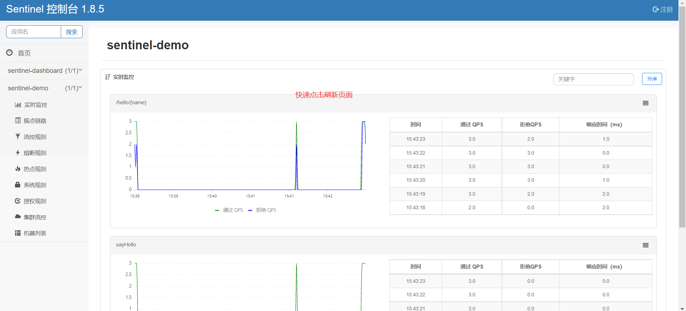
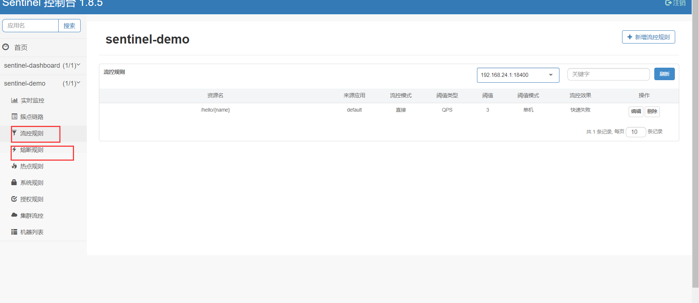
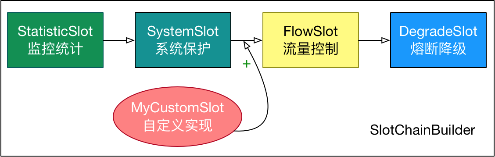

### SpringCloud Alibaba Sentinel 实践与原理分析

#### 一、实践

随着微服务的流行，服务和服务之间的稳定性变得越来越重要。Sentinel 是面向分布式、多语言异构化服务架构的**流量治理组件**，主要以流量为切入点，从流量路由、流量控制、流量整形、熔断降级、系统自适应过载保护、热点流量防护等多个维度来帮助开发者保障微服务的稳定性。参考官方文档https://sentinelguard.io/zh-cn/docs/logs.html

基本概念：

- 资源：需要流量保护的资源，它可以是 Java 应用程序中的任何内容，例如，由应用程序提供的服务，或由应用程序调用的其它应用提供的服务，甚至可以是一段代码。在接下来的文档中，我们都会用资源来描述代码块。

  只要通过 Sentinel API 定义的代码，就是资源，能够被 Sentinel 保护起来。大部分情况下，可以使用方法签名，URL，甚至服务名称作为资源名来标示资源。

- 规则：围绕资源的实时状态设定的规则，可以包括流量控制规则、熔断降级规则以及系统保护规则。所有规则可以动态实时调整。

流量控制的角度

- 资源的调用关系，例如资源的调用链路，资源和资源之间的关系；
- 运行指标，例如 QPS、线程池、系统负载等；
- 控制的效果，例如直接限流、冷启动、排队等。

熔断-降级的概念：https://zhuanlan.zhihu.com/p/61363959

熔断降级原则：Sentinel 和 Hystrix 的原则是一致的: 当调用链路中某个资源出现不稳定，例如，表现为 timeout，异常比例升高的时候，则对这个资源的调用进行限制，并让请求快速失败，防止请求堆积避免影响到其它的资源，最终产生雪崩的效果。

在限制的手段上，Sentinel 和 Hystrix 采取了完全不一样的方法。Hystrix 通过[线程池](https://github.com/Netflix/Hystrix/wiki/How-it-Works#benefits-of-thread-pools)的方式，来对依赖(在我们的概念中对应资源)进行了隔离。这样做的好处是资源和资源之间做到了最彻底的隔离。缺点是除了增加了线程切换的成本，还需要预先给各个资源做线程池大小的分配。

Sentinel 对这个问题采取了两种手段:

- 通过并发线程数进行限制：和资源池隔离的方法不同，Sentinel 通过限制资源并发线程的数量，来减少不稳定资源对其它资源的影响。这样不但没有线程切换的损耗，也不需要您预先分配线程池的大小。当某个资源出现不稳定的情况下，例如响应时间变长，对资源的直接影响就是会造成线程数的逐步堆积。当线程数在特定资源上堆积到一定的数量之后，对该资源的新请求就会被拒绝。堆积的线程完成任务后才开始继续接收请求。

- 通过响应时间对资源进行降级：除了对并发线程数进行控制以外，Sentinel 还可以通过响应时间来快速降级不稳定的资源。当依赖的资源出现响应时间过长后，所有对该资源的访问都会被直接拒绝，直到过了指定的时间窗口之后才重新恢复。

##### 1、项目环境搭建

Sentinel 的原生使用可以分为两个部分:

- 核心库（Java 客户端）：不依赖任何框架/库，能够运行于 Java 8 及以上的版本的运行时环境，同时对 Dubbo / Spring Cloud 等框架也有较好的支持（见 [主流框架适配](https://sentinelguard.io/zh-cn/docs/open-source-framework-integrations.html)）。
- 控制台（Dashboard）：Dashboard 主要负责管理推送规则、监控、管理机器信息等。

Sentinel可以适配多种框架，新建Maven项目导入SpringCloud的依赖https://github.com/alibaba/spring-cloud-alibaba/wiki/Sentinel，因为测试使用的SpringCloud Alibaba ，因此可以直接使用@SentinelSource注解，具体额用法就是在指定service上加上@SentinelSource注解https://github.com/alibaba/Sentinel/wiki/%E6%B3%A8%E8%A7%A3%E6%94%AF%E6%8C%81。

另外就是pom文件配置

```xml
 <properties>
        <java.version>11</java.version>
        <project.build.sourceEncoding>UTF-8</project.build.sourceEncoding>
        <project.reporting.outputEncoding>UTF-8</project.reporting.outputEncoding>
        <spring-boot.version>2.4.4</spring-boot.version>
        <spring-cloud.version>2021.1</spring-cloud.version>
    </properties>
    <dependencies>
<!--        Sentinel使用-->

        <dependency>
            <groupId>com.alibaba.cloud</groupId>
            <artifactId>spring-cloud-starter-alibaba-sentinel</artifactId>
        </dependency>


        <dependency>
            <groupId>org.springframework.boot</groupId>
            <artifactId>spring-boot-starter-web</artifactId>
        </dependency>

        <dependency>
            <groupId>org.projectlombok</groupId>
            <artifactId>lombok</artifactId>
            <optional>true</optional>
        </dependency>
        <dependency>
            <groupId>org.springframework.boot</groupId>
            <artifactId>spring-boot-starter-test</artifactId>
            <scope>test</scope>
            <exclusions>
                <exclusion>
                    <groupId>org.junit.vintage</groupId>
                    <artifactId>junit-vintage-engine</artifactId>
                </exclusion>
            </exclusions>
        </dependency>
    </dependencies>

    <dependencyManagement>
        <dependencies>
            <!--    springcloud 依赖版本管理-->
            <dependency>
                <groupId>com.alibaba.cloud</groupId>
                <artifactId>spring-cloud-alibaba-dependencies</artifactId>
                <version>${spring-cloud.version}</version>
                <type>pom</type>
                <scope>import</scope>
            </dependency>
            <!--    springboot 依赖版本管理-->

            <dependency>
                <groupId>org.springframework.boot</groupId>
                <artifactId>spring-boot-dependencies</artifactId>
                <version>${spring-boot.version}</version>
                <type>pom</type>
                <scope>import</scope>
            </dependency>
        </dependencies>


    </dependencyManagement>
```


##### 2、安装可视化面板

安装Dashboard面板，需要下载单独的jar包本地运行，下载地址https://github.com/alibaba/Sentinel/releases，端口随意指定

```
java -Dserver.port=8050 -Dcsp.sentinel.dashboard.server=localhost:8050 -Dproject.name=sentinel-dashboard -jar sentinel-dashboard.jar
```

然后在yml配置文件配置地址即可

```yml
spring:
  cloud:
    sentinel:
      transport:
        port: 8719 # 随意指定，默认是8719不要和自己的微服务端口8080和dashboard的8050相同
        dashboard: localhost:8050
```


##### 3、测试可视化面板配置流控规则

打开可视化面板localhost:8050，账密都是sentinel登录，**如果发现监控不到自己的微服务名称，就访问一下自己的任意微服务接口，然后刷新页面**，配置流控规则然后在测试...






##### 4、测试自定义流控阈值回调方法

可视化面板定义流控、熔断，发现虽然能起到流量保护，但是提示不是很人性，可以在@SentinelSource注解通过配置blockHandler、fallback、defaultFallback等来自定义方法提示用户。@SentinelResource 用于定义资源，并提供可选的异常处理和 fallback 配置项。 @SentinelResource 注解包含以下属性：

- value：资源名称，必需项（不能为空）
- entryType：entry 类型，可选项（默认为 EntryType.OUT）
- blockHandler / blockHandlerClass: blockHandler 对应处理 BlockException 的函数名称，可选项。blockHandler 函数访问范围需要是 public，返回类型需要与原方法相匹配，参数类型需要和原方法相匹配并且最后加一个额外的参数，类型为 BlockException。blockHandler 函数默认需要和原方法在同一个类中。若希望使用其他类的函数，则可以指定 blockHandlerClass 为对应的类的 Class 对象，注意对应的函数必需为 static 函数，否则无法解析。
- fallback / fallbackClass：fallback 函数名称，可选项，用于在抛出异常的时候提供 fallback 处理逻辑。fallback 函数可以针对所有类型的异常（除了 exceptionsToIgnore 里面排除掉的异常类型）进行处理。fallback 函数签名和位置要求：
  返回值类型必须与原函数返回值类型一致；方法参数列表需要和原函数一致，或者可以额外多一个 Throwable 类型的参数用于接收对应的异常。fallback 函数默认需要和原方法在同一个类中。若希望使用其他类的函数，则可以指定 fallbackClass 为对应的类的 Class 对象，注意对应的函数必需为 static 函数，否则无法解析。
- defaultFallback（since 1.6.0）：默认的 fallback 函数名称，可选项，通常用于通用的 fallback 逻辑（即可以用于很多服务或方法）。默认 fallback 函数可以针对所有类型的异常（除了 exceptionsToIgnore 里面排除掉的异常类型）进行处理。若同时配置了fallback 和 defaultFallback，则只有 fallback 会生效。defaultFallback 函数签名要求：返回值类型必须与原函数返回值类型一致；
  方法参数列表需要为空，或者可以额外多一个 Throwable 类型的参数用于接收对应的异常。defaultFallback 函数默认需要和原方法在同一个类中。若希望使用其他类的函数，则可以指定 fallbackClass 为对应的类的 Class 对象，注意对应的函数必需为 static 函数，否则无法解析。
- exceptionsToIgnore（since 1.6.0）：用于指定哪些异常被排除掉，不会计入异常统计中，也不会进入 fallback 逻辑中，而是会原样抛出。1.8.0 版本开始，defaultFallback 支持在类级别进行配置。注：1.6.0 之前的版本 fallback 函数只针对降级异常（DegradeException）进行处理，不能针对业务异常进行处理。

特别地，若 blockHandler 和 fallback 都进行了配置，则被限流降级而抛出 BlockException 时只会进入 blockHandler 处理逻辑。若未配置 blockHandler、fallback 和 defaultFallback，则被限流降级时会将 BlockException 直接抛出（若方法本身未定义 throws BlockException 则会被 JVM 包装一层 UndeclaredThrowableException）。

```java
package henu.soft.scl.service;

import com.alibaba.csp.sentinel.annotation.SentinelResource;
import com.alibaba.csp.sentinel.slots.block.BlockException;
import henu.soft.scl.utils.ExceptionUtil;
import org.springframework.stereotype.Service;

/**
 * @author sichaolong
 * @date 2022/8/27 10:15
 */
@Service
public class TestService {
    @SentinelResource(value = "hello")
    public String hello(String name) {
        return "Hello, " + name;
    }


    // 原函数
    @SentinelResource(value = "sayHello", blockHandler = "exceptionHandler", fallback = "sayHelloFallback")
    public String sayHello(String num) {
        return String.format("Hello at %d", Integer.valueOf(num));
    }

    // Fallback 函数，函数签名与原函数一致或加一个 Throwable 类型的参数.
    public String sayHelloFallback(Integer s) {
        return String.format("sayHelloFallback %d", s);
    }

    // Block 异常处理函数，参数最后多一个 BlockException，其余与原函数一致.
    public String exceptionHandler(Integer s, BlockException ex) {
        // Do some log here.
        ex.printStackTrace();
        return "exceptionHandler, error occurred at " + s;
    }

    // 这里单独演示 blockHandlerClass 的配置.
    // 对应的 `handleException` 函数需要位于 `ExceptionUtil` 类中，并且必须为 public static 函数.
    @SentinelResource(value = "test", blockHandler = "handleException", blockHandlerClass = {ExceptionUtil.class})
    public String test() {
        System.out.println("Test");
        return "sichaolong-test";

    }
}

```

更多使用参考中文文档：https://sentinelguard.io/zh-cn/docs/circuit-breaking.html

#### 二、原理分析

先看下官网文档基本原理https://sentinelguard.io/zh-cn/docs/basic-implementation.html，简单理解就是sentinel将微服务接口资源抽象为资源，对于统计数据则抽象为Invocation Tree 树形结构，每个统计数据抽象为Node。并自动创建对应的Entry，然后整体的监控信息、流控信息等是通过一个个类保存，这些相关类称为功能插槽（slot chain）。这些插槽有不同的职责


目前的设计是 one slot chain per resource，因为某些 slot 是 per resource 的（比如 NodeSelectorSlot），简单理解就是统计功能插槽相关统计信息、流量限制等功能 需要在请求Action之前来完成。

Sentinel 将 `ProcessorSlot` 作为 SPI 接口进行扩展（1.7.2 版本以前 `SlotChainBuilder` 作为 SPI），使得 Slot Chain 具备了扩展的能力。您可以自行加入自定义的 slot 并编排 slot 间的顺序，从而可以给 Sentinel 添加自定义的功能。





##### 1、核心类分析

文档https://github.com/alibaba/Sentinel/wiki/Sentinel-%E6%A0%B8%E5%BF%83%E7%B1%BB%E8%A7%A3%E6%9E%90


###### ProcessorSlotChain

Sentinel 的核心骨架，将不同的 Slot 按照顺序串在一起（责任链模式），从而将不同的功能（限流、降级、系统保护）组合在一起。slot chain 其实可以分为两部分：统计数据构建部分（statistic）和判断部分（rule checking）

```java
public abstract class ProcessorSlotChain extends AbstractLinkedProcessorSlot<Object> {
    public ProcessorSlotChain() {
    }

    public abstract void addFirst(AbstractLinkedProcessorSlot<?> var1);

    public abstract void addLast(AbstractLinkedProcessorSlot<?> var1);
}

// 其中默认实现类是 DefaultProcessorSlotChain，相当于维持一个双指针链表
 public void addFirst(AbstractLinkedProcessorSlot<?> protocolProcessor) {
        protocolProcessor.setNext(this.first.getNext());
        this.first.setNext(protocolProcessor);
        if (this.end == this.first) {
            this.end = protocolProcessor;
        }

    }

    public void addLast(AbstractLinkedProcessorSlot<?> protocolProcessor) {
        this.end.setNext(protocolProcessor);
        this.end = protocolProcessor;
    }
	// 抽象封装Entry
 	public void entry(Context context, ResourceWrapper resourceWrapper, Object t, int count, boolean prioritized, Object... args) throws Throwable {
        this.first.transformEntry(context, resourceWrapper, t, count, prioritized, args);
    }
```


待更新...